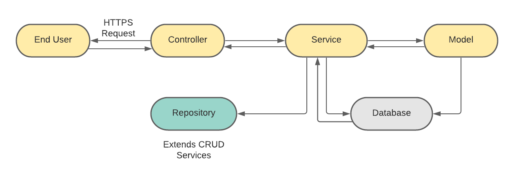

# search-algorithm
A search algorithm implemented in Java. 
It allows the user to specify an input file of data or a given dataset and will allow searches for specific words and returns their corresponding objects.

# Requirements:
- Java JDK
- Maven
- IntelliJ IDEA

# Workflow Diagram: 


# Setup:
1. Clone the application
```
https://github.com/AarshiyaGuneja/SearchAlgorithm.git
```
2. Create MySQL database (you can choose database of your choice - just the configurations for that database will be different)
```
create database databaseName
```
3. Change configurations of database in application.properties file.
4. Build and package the application using Maven
```
mvn package
```
5. Run the application using command: 
```
java -jar target/SearchAlgorithm-1.0-SNAPSHOT.jar 
```

The application will be up at localhost and on the port which is defined in application.properties file.

The application exposed /search API.
```
Fetching all the objects which is related to the word that is searched.

```
Furthermore, the algorithms allows AND for and search on two words and OR for or search on two words.
